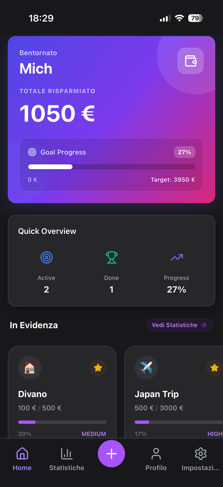
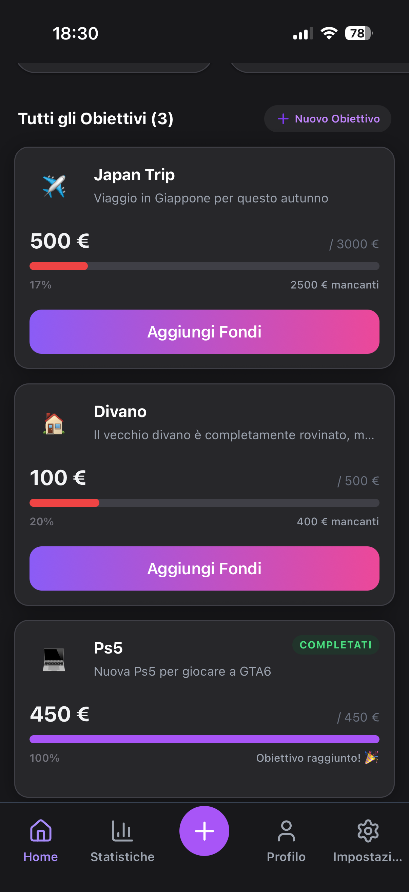
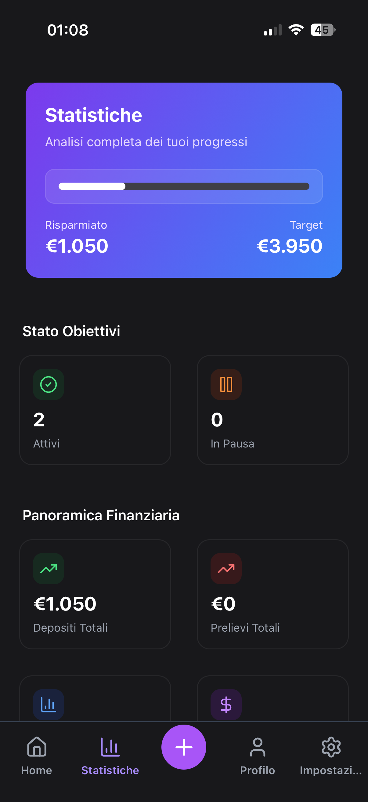
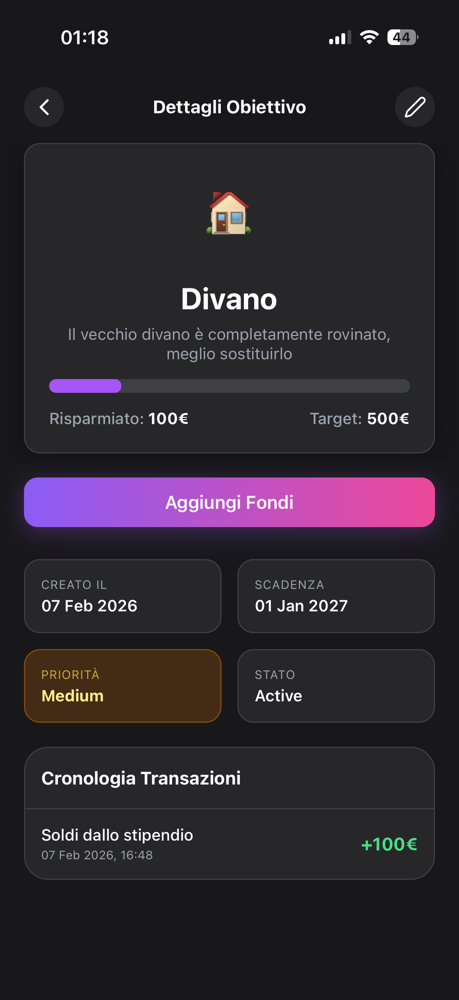

# SaveUp

SaveUp è un'applicazione mobile per la gestione degli obiettivi di risparmio personale, sviluppata con Expo, React Native e TypeScript.

## Funzionalità principali

- Creazione e gestione di obiettivi di risparmio
- Visualizzazione delle statistiche di progresso
- Notifiche e reminder *(WIP)
- Interfaccia moderna con supporto tema chiaro/scuro
- **Supporto Multilingua (Italiano / Inglese)**
- **Splash Screen gestito correttamente**
- Storico delle transazioni per ogni obiettivo
- Navigazione a tab e modali
- Animazioni e icone personalizzate

## Anteprima

<p align="center">
  
  
  
  
</p>

## Struttura del progetto

- `app/` — Routing e pagine principali (tab, modali, auth, obiettivi)
- `components/` — Componenti UI riutilizzabili (Card, Button, StatCard, GoalCard, ecc.)
- `services/` — Servizi come notifiche (*Ancora WIP*)
- `store/` — Gestione stato globale con Zustand
- `assets/` — Immagini e icone

## Stack tecnologico

- **React Native** (Expo)
- **TypeScript**
- **Zustand** per lo stato globale
- **Tailwind CSS** (NativeWind) per lo styling
- **Expo Router** per la navigazione
- **Lucide Icons** per le icone
- **Date-fns** per la gestione delle date

## Informazioni aggiuntive
La schermata delle impostazioni è solo un esempio grafico e gli unici pulsanti che effettivamente funzionano sono il cambio tema, Logout ed Eliminazione dell'account

## Avvio rapido

1. Installa le dipendenze:
	```sh
	npm install
	```
2. Avvia l'app in modalità sviluppo:
	```sh
	npm start
	```
	Oppure:
	```sh
	npm run android
	npm run ios
	npm run web
	```

## Script utili

- `npm run lint` — Analizza il codice con ESLint
- `npm run reset-project` — Resetta la configurazione del progetto
